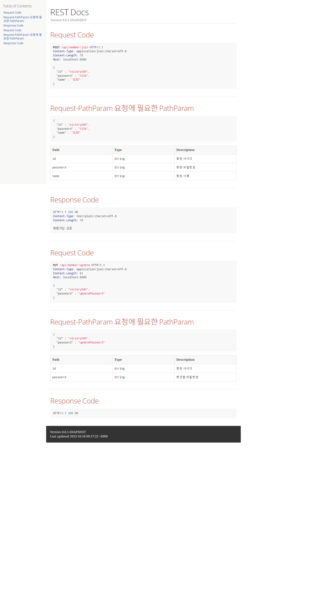

# REST docs 테스트

<br/>

## 테스트 코드 작성

```java
package com.example.restdocs.member;


import com.example.restdocs.common.ControllerTest;
import com.example.restdocs.member.model.dto.request.MemberJoinRequest;
import com.example.restdocs.member.model.dto.request.MemberUpdateRequest;
import org.junit.jupiter.api.*;
import org.springframework.http.MediaType;
import org.springframework.restdocs.mockmvc.RestDocumentationRequestBuilders;

import static org.springframework.restdocs.mockmvc.MockMvcRestDocumentation.document;
import static org.springframework.restdocs.operation.preprocess.Preprocessors.preprocessRequest;
import static org.springframework.restdocs.operation.preprocess.Preprocessors.prettyPrint;
import static org.springframework.restdocs.payload.PayloadDocumentation.fieldWithPath;
import static org.springframework.restdocs.payload.PayloadDocumentation.requestFields;
import static org.springframework.test.web.servlet.result.MockMvcResultMatchers.status;
public class MemberControllerTest extends ControllerTest {

    @BeforeEach
    void set_up(){

        MemberJoinRequest request = MemberJoinRequest.builder()
                                                                .id("victoryddh")
                                                                .password("1234")
                                                                .name("도하")
                                                                .build();

        memberService.save(request);

        System.out.println("BeforeEach Stared");

    }

    @Test
    @DisplayName("회원가입 성공")
    void Success_join() throws Exception {

        MemberJoinRequest request = MemberJoinRequest.builder()
                                                    .id("victoryddh")
                                                    .password("1234")
                                                    .name("도하")
                                                    .build();

        mockMvc.perform(RestDocumentationRequestBuilders.post("/api/member/join")
                    .contentType(MediaType.APPLICATION_JSON)
                    .content(objectMapper.writeValueAsBytes(request)))
                .andDo(
                        document("member/join",
                                preprocessRequest(prettyPrint()),
                                requestFields(
                                        fieldWithPath("id").description("회원 아이디"),
                                        fieldWithPath("password").description("회원 비밀번호"),
                                        fieldWithPath("name").description("회원 이름")
                                ))
                )
                .andExpect(status().isOk());

    }

    @Test
    @DisplayName("비밀번호 변경")
    void update_member() throws Exception {

        MemberUpdateRequest request = MemberUpdateRequest.builder()
                                                                        .id("victoryddh")
                                                                        .password("updatePassword")
                                                                        .build();


        mockMvc.perform(RestDocumentationRequestBuilders.put("/api/member/update")
                    .contentType(MediaType.APPLICATION_JSON)
                    .content(objectMapper.writeValueAsBytes(request)))
                .andDo(
                        document("member/update",
                                preprocessRequest(prettyPrint()),
                                requestFields(
                                        fieldWithPath("id").description("회원 아이디"),
                                        fieldWithPath("password").description("변경할 비밀번호")
                                )
                        )
                )
                .andExpect(status().isOk());

    }
}
```

<br/>

## adoc 파일 설정

```adoc
= REST Docs
:doctype: book
:icons: font
:source-highlighter: highlightjs
:toc: left
:toclevels: 2
:sectlinks:


ifndef::snippets[]
:snippets: ./build/generated-snippets
endif::[]

== Request Code
include::{snippets}/member/join/http-request.adoc[]

== Request-PathParam 요청에 필요한 PathParam
include::{snippets}/member/join/request-body.adoc[]

include::{snippets}/member/join/request-fields.adoc[]

== Response Code
include::{snippets}/member/join/http-response.adoc[]

== Request Code
include::{snippets}/member/update/http-request.adoc[]

== Request-PathParam 요청에 필요한 PathParam
include::{snippets}/member/update/request-body.adoc[]

include::{snippets}/member/update/request-fields.adoc[]

== Response Code
include::{snippets}/member/update/http-response.adoc[]
```

<br/>

## 실행 결과


