# SAMSUNG SDS APIM

## 목차

1. [프로젝트 소개](#프로젝트-소개)
2. [사용 기술](#사용-기술)
3. [팀원 소개](#팀원-소개)
4. [프로젝트 산출물](#프로젝트-산출물)
5. [서비스 화면 및 기능 소개](#서비스-화면-및-기능-소개)

# 프로젝트 소개

기업은 내부 및 외부 시스템간 데이터나 어플리케이션을 연계하여
서비스를 제공하고 있습니다.

대부분의 서비스들은 API로 기능을 제공하기에 이를 관리하기 위하여 APIM이라고 하는 API 게이트웨이 및 관리시스템을 사용합니다.

작은 규모의 회사나, 부서 단위에서 사용할 수 있는 자체 APIM
서비스를 개발하였습니다.

- SSAFY 9기 2학기 자율 프로젝트 (삼성 SDS 기업 연계 프로젝트)
- 프로젝트 이름 : SAMSUMG SDS APIM
- 개발 기간 : 2023.10.10. ~ 2023.11.17 (6주)
- 사용 대상
  - API를 사용하는 일반 사용자
  - API를 개발하는 개발자
  - API를 관리하는 운영자

# 사용 기술

## Frontend

- Atomic 디자인 패턴
- Storybook을 사용하여 컴포넌트 문서화
- zustand, react query를 사용하여 전역, 원격 상태 관리
- 컴파일 단계에서 오류를 발견할 수 있는 typeScript, SSR이 가능한 NEXT.js 사용

## Backend

### Spring cloud eureka

- Spring cloud eureka를 사용하여 Gateway 서버, Discovery 서버, Service 서버 구현
- Elasticsearch를 사용하여 빠르게 로그 적재
- Prometheus, loki를 통해 서버 마이크로미터 생성
- Grafana, klibana를 통해 서버, 사용량 모니터링
- nGrinder를 통해 부하테스트후 허용 tps 설정
- queryDSL을 통한 조인문 조회

## Devops

## Cooperation

# 팀원 소개

| 문지은    | 박서희    | 송아람      |
| --------- | --------- | ----------- |
| Front-end | Front-end | Team Leader |
| UI/UX     | UI/UX     | Front-end   |
|           |           | UI/UX       |

| 이도하   | 이찬웅   |
| -------- | -------- |
| Back-end | Back-end |
| Server   | Server   |
| CI/CD    |          |

# 프로젝트 산출물

| 시스템 아키텍처                               |
| --------------------------------------------- |
| 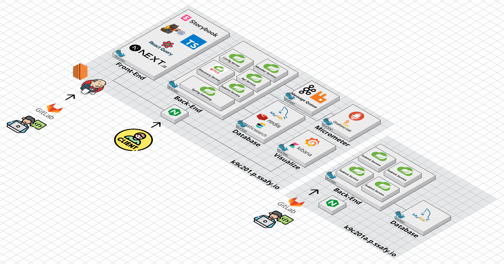 |

| ERD                                  |
| ------------------------------------ |
| 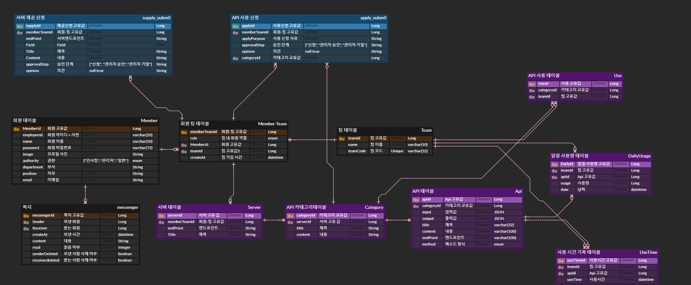 |

# 서비스 화면 및 기능 소개

### API 관리

- API docs(Swagger)를 활용한 API 제공 신청

| API 제공 신청                          |
| -------------------------------------- |
| 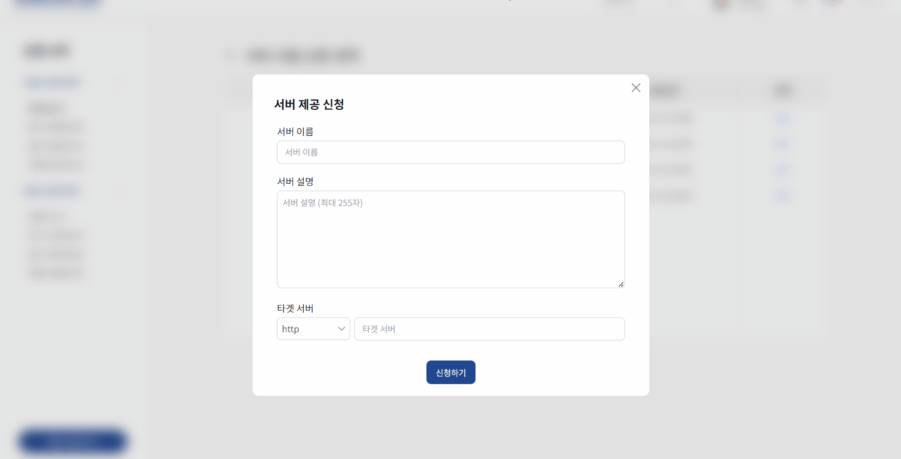 |

- 사용 신청을 통한 팀 토큰 발급

| API 사용 신청                      |
| ---------------------------------- |
|  |

| 팀 토큰 확인                        |
| ----------------------------------- |
| 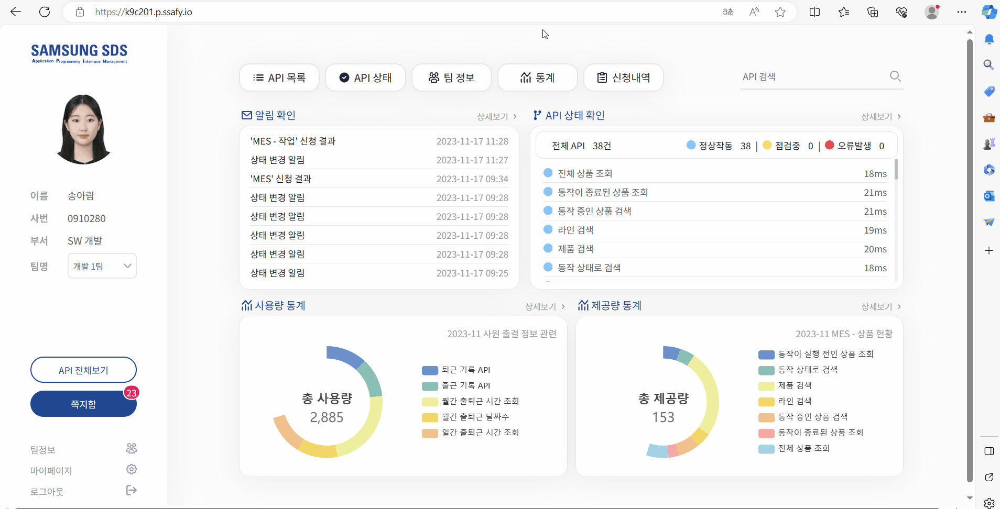 |

- API 제공, 사용 신청에 대한 승인, 거절

| API 관리                             |
| ------------------------------------ |
| 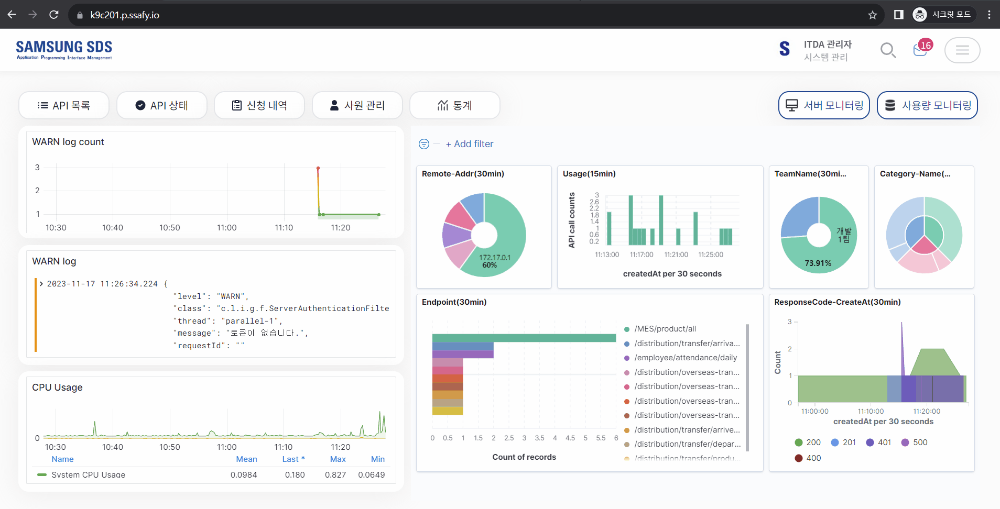 |

### API 정보 제공

- 일정 시간마다 전체 API에 대한 테스트 진행 후 사용자에게 정상/점검/대기 상태 정보 제공

| API 상태                         |
| -------------------------------- |
| 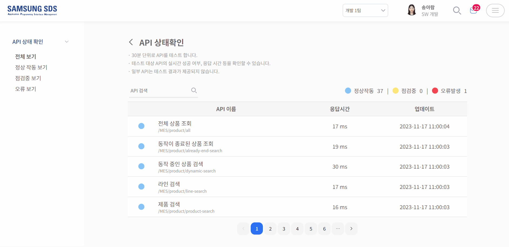 |

- API 상세 정보 제공

| API 상세 페이지                     |
| ----------------------------------- |
| 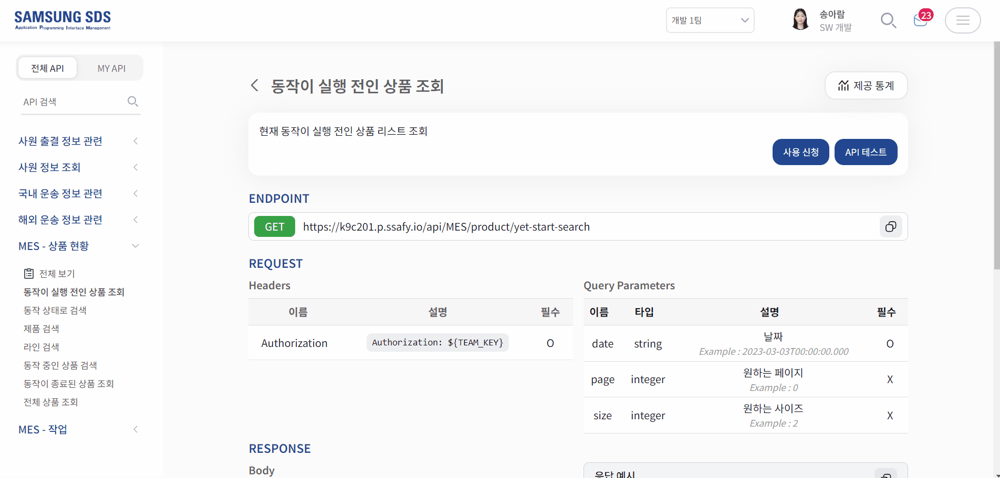 |

- API 테스트를 통해 응답 결과 확인 가능

| API 테스트 페이지                 |
| --------------------------------- |
| 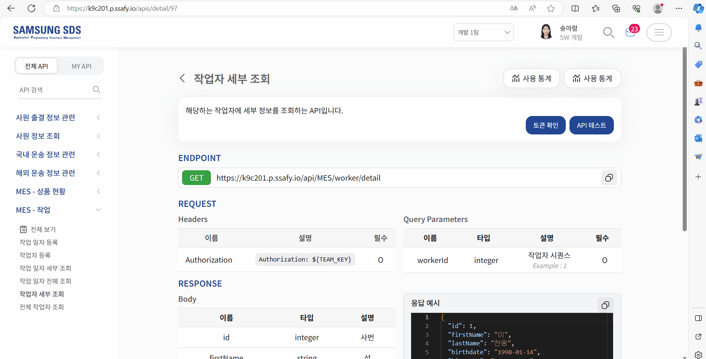 |

### 사용량/서버 모니터링

| 사용량 모니터링                           |
| ----------------------------------------- |
| 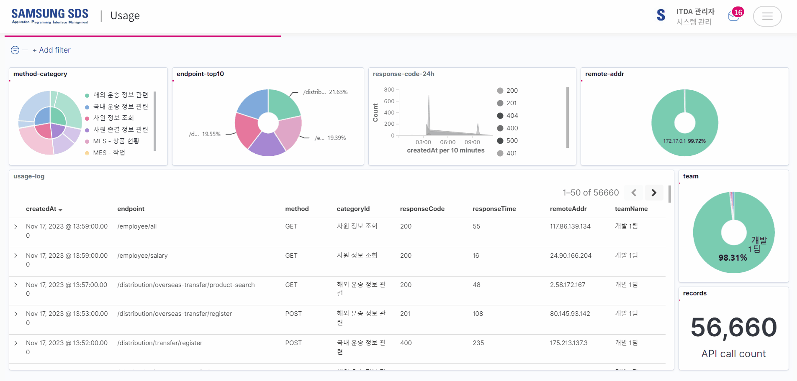 |

| 서버 모니터링                              |
| ------------------------------------------ |
| 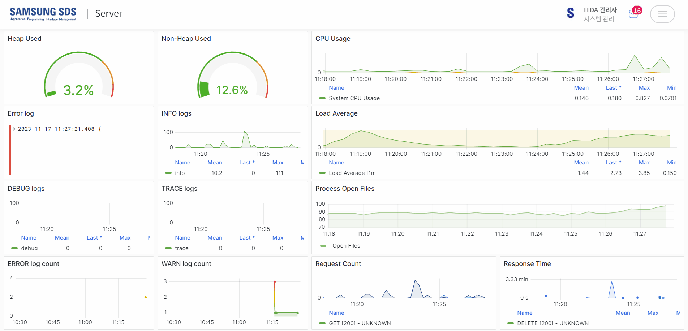 |

## 사용량/제공량 통계 제공

| 카테고리 통계                                |
| -------------------------------------------- |
| 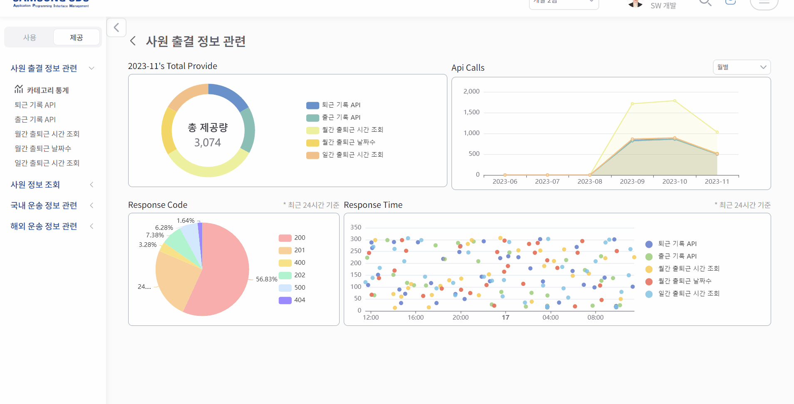 |

| API 통계                                |
| --------------------------------------- |
| 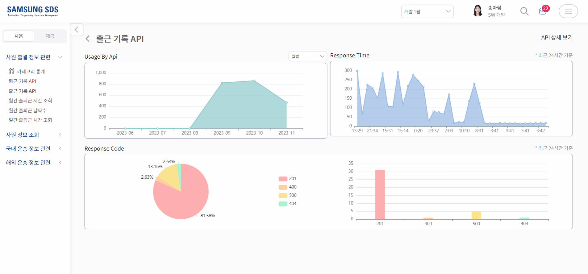 |

## 쪽지 및 실시간 알림 기능

- 쪽지함

| 쪽지함                            |
| --------------------------------- |
| 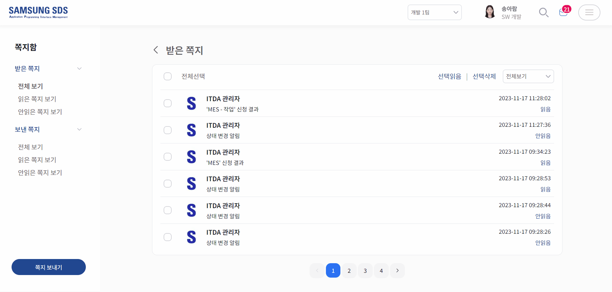 |

- 실시간 알림 기능

| 쪽지 도착 알림                    | 사용 신청 승인 알림                    |
| --------------------------------- | -------------------------------------- |
|  | 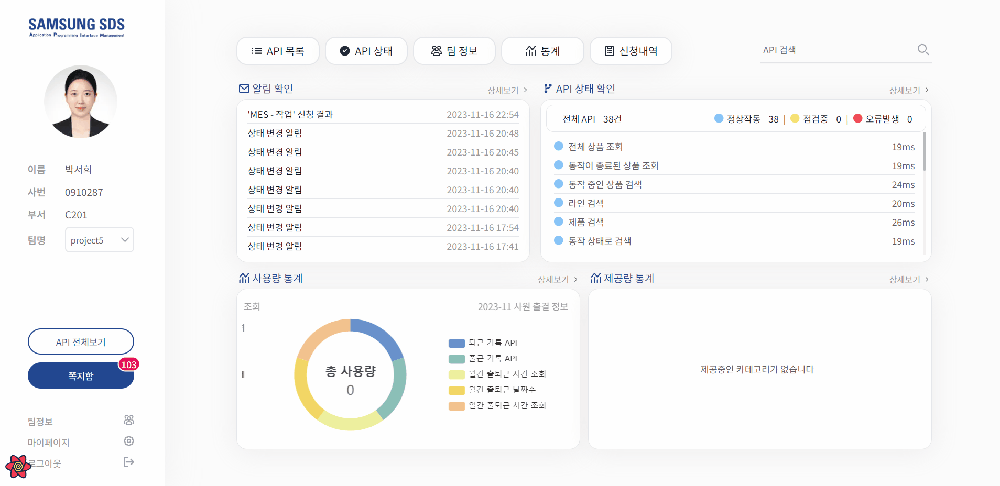 |

| API 상태 변경 알림                     | 신청 내용 등록 알림 (관리자)            |
| -------------------------------------- | --------------------------------------- |
| 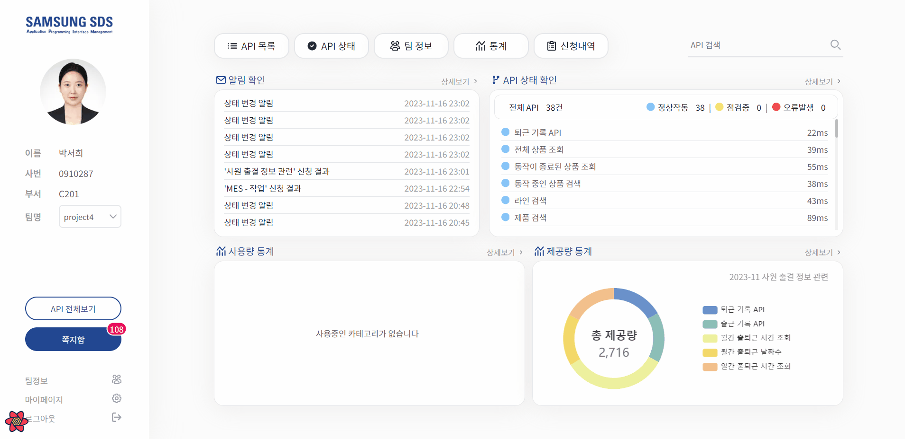 | 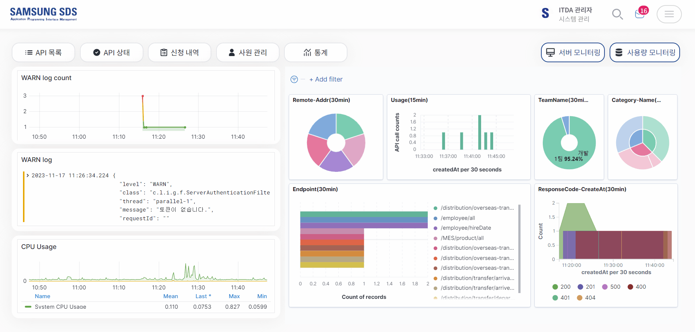 |
